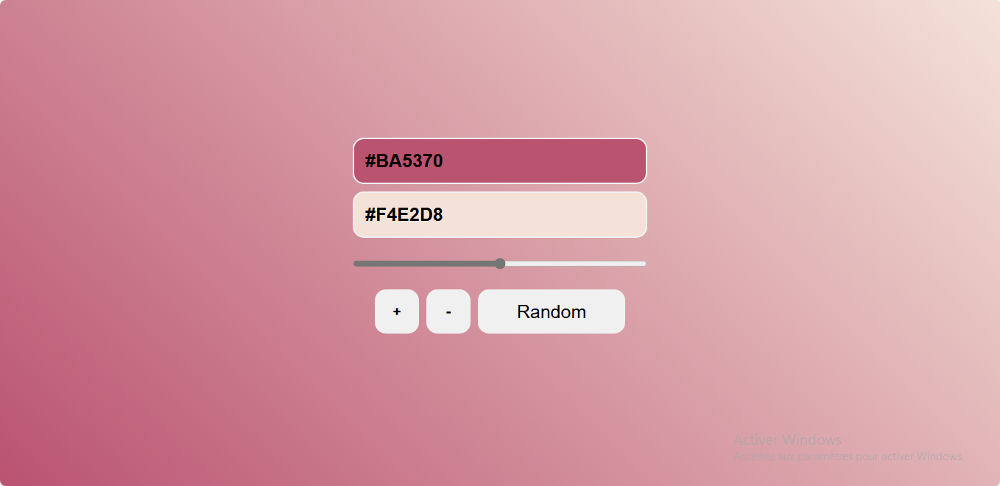

# 🌈 Gradient Generator

A dynamic gradient generator that lets you create and customize beautiful color gradients for your background.

## ✨ Features

- 🎨 **Two color inputs** for base gradient colors
- ➕ **Add button** to include more color stops
- ➖ **Remove button** to simplify gradients
- 🎲 **Random button** for instant inspiration
- 🔄 **Angle control** (0-360° range slider)
- 🖥️ **Live preview** applied to body background
- 📋 **CSS code output** for easy copying

## 🛠️ Tech Stack

- HTML5
- CSS3
- Vanilla JavaScript

## 🚀 How to Use

1. Select your base colors using the color pickers
2. Adjust gradient angle with the range slider
3. Add/remove color stops as needed
4. Click "Random" for surprise combinations
5. The background updates instantly
6. Copy the generated CSS code for your projects

## 🎓 Learning Focus

Built to practice:
- DOM manipulation with color inputs
- Dynamic CSS gradient generation
- Event handling for range inputs
- Random color generation algorithms
- Interactive UI updates

## 📸 Preview

## 🚀 Getting Started

## 🎓 Learning Source
This project was built while following a course on Udemy as part of a training to practice handling cookies in JavaScript.

## 👨‍💻 Author

### Grace Ariane
Frontend developer passionate about creative coding tools ✨
- linkedIn - [Grace Ariane Tchoukeu](https://www.linkedin.com/in/grace-ariane-tchoukeu)

**Tip:** Great for finding beautiful background combinations for your web projects!